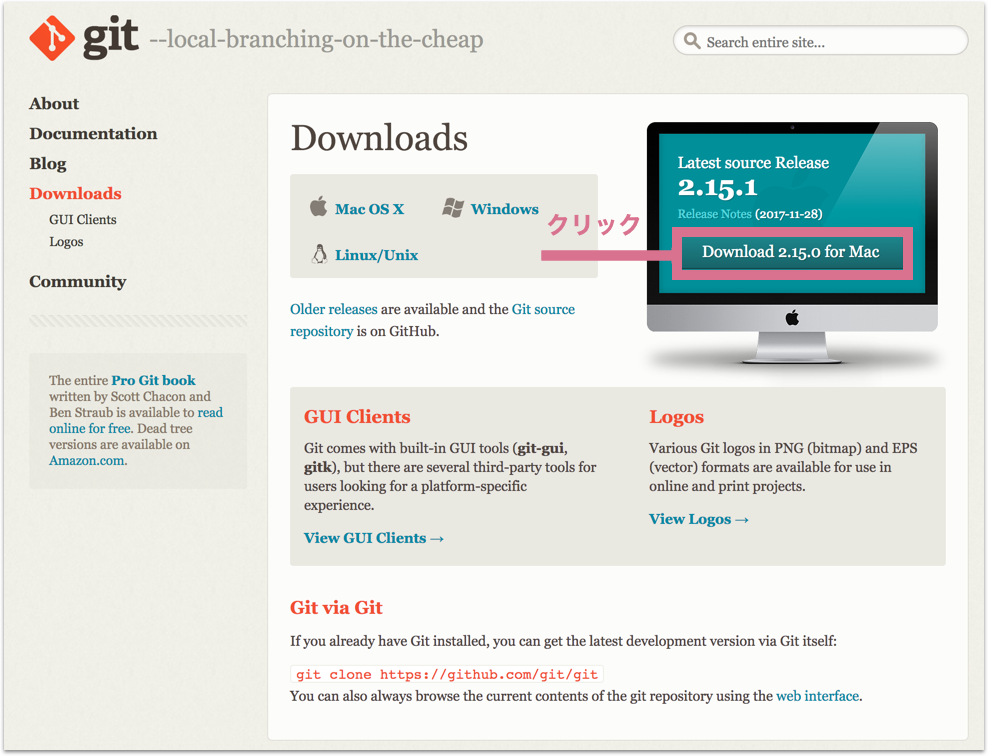

## Gitをインストールする

文章だけ読んでも理解が大変かと思いますのでまずは使ってみましょう。Gitは以下のページからダウンロードすることが出来ます。なおWindowsでPowerShellを使う場合の方法はこの項目の後に出てきます。

1. Gitインストーラーのダウンロード

[Git - Downloads](https://git-scm.com/downloads)

 

2. インストール

ファイルのダウンロードが完了したら、ダウンロードしたファイルを解凍して出てきたファイルをクリックします。指示に従って進むとインストール完了です。

**Windowsの場合**
Windowsの場合は途中の画面で"Adjusting your PATH environment"という項目が出てきます。ここでは、"Use Git from Git Bash only"を選んで下さい。

3. 確認する

インストールが完了したらターミナルを起動して確認してみましょう。(結果表示はインストールしたバージョンによって異なります。)

**Windowsの場合**
Windowsの場合は"git bash"というアプリをAdministrator権限で開く必要があります。検索ツールでgitと入れると"git bash"が出てくるはずですので、右クリックで"Run as administrator"を選んで起動します。

```bash
$ git --version
git version 2.12.2
```

### WindowsのPowerShellでGitを使う

WindowsのPowerShellでGitを利用する際にはパッケージマネージャーChocolateyを利用します。(Chocolateyのインストール方法については、準備コースのPowerShellのテキストを参考にしてください。)

```bash
$ choco install 
$ git --version
```

## Gitの初期設定

Gitのインストールが完了したら初期設定を行いましょう。設定にはコマンドラインを利用します。

### 利用者の名前を設定する

```bash
$ git config --global user.name "自分の名前"
```

### 利用者のメールアドレスを設定する

```bash
% git config --global user.name "自分の名前"
```

### デフォルトのエディタを設定する

- nanoを利用する

コマンドライン入門で紹介したエディタnanoを利用するには以下のように入力します。

```bash
$ git config --global core.editor "nano -w"
```

- Atomを利用する

既にAtom入門を完了して、コマンドラインからAtomを使える状態でしたら以下のコマンドでAtomをデフォルトのエディタに設定しましょう。

```bash
$ git config --global core.editor "atom --wait"
```